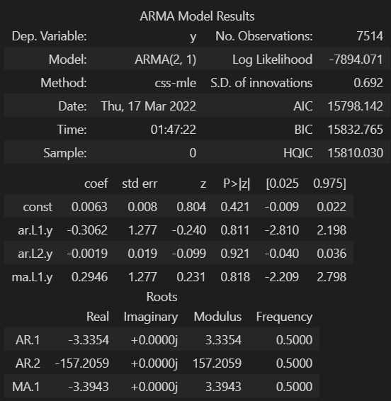

# Yen Futures: Should we buy JPY?

Premise:

* We need to decide if it is financially sound to buy Japanese Yen (JPY) now based on predicted future returns and volatilty.
* We need to forecast the next **5 days** of Yen volatilty and returns, predict if returns are increasing/decreasing that favors buying.
* We will use historic-time series data on Yen returns, and build a series of different models based on different methods *ARMA*, *ARIMA*, *GARCH* using **statsmodels** module.
* We will also use **sklearn** module to make Linear Regression models, splitting the yen data into training and test components, and Rolling Out-of-Sample methods to test the models goodness of fit with the model.

Installs needed

Most of time-series model functions are built-in. To import these modules:

`from statsmodels.tsa.arima_model import ARMA` and `import ARIMA`

For the 

For the GARCH model:
`conda install -c bashtage arch` or you simply use `pip install arch`

`from arch import arch_model`

What does the yen data file contain?

Run a simple `.shape` or  on the raw dataframe and it will

* Date, which is the index column because we need to be able to depreciate parts of the date. 
* Open, opening price for the Yen that day.
* High, the highest price for the yen in that day.
* Low, the lowest price for the Yen in the day.
* Last
* Settle, this the main column that we are making our forecasts with. 
* Volume, the amount of yen traded that day.
* Previous Day Open Interest

# Part 1: Time-Series Analysis

## Imports:
<pre><code>
import numpy as np
import pandas as pd
from pathlib import Path
%matplotlib inline
import warnings
warnings.filterwarnings('ignore')
</code></pre>

You'll need to import the `sickit-learn` modules. This will be used to

<pre><code>import statsmodels.api as sm</code></pre>

## Read-in data and cleanup

We create a starting dataframe by reading in the `yen.csv` and I'll call it `yen_futures`.

<pre><code>
yen_futures = pd.read_csv(
    Path("yen.csv"), index_col="Date", infer_datetime_format=True, parse_dates=True
)
yen_futures.head()
</code></pre>

What you should see

 

Slice the dataframe. Only use rows from **Jan 1 1990 to present**. 
<pre><code>yen_futures = yen_futures.loc["1990-01-01":, :]</code></pre>

Plot the raw returns based on the *Settle* column of the dataset.
<pre><code>yen_futures['Settle'].plot(title='Yen Futures Settle Prices', ylabel='Settle Price in $USD', figsize=(15,10))</code></pre>

What you should see

    

    
Overall the view of Yen settle prices are somewhat increasing as time goes on across the x-axis with periodic bursts of rises/falls. Specifically I am seeing a pattern of gradual incrases followed by gradual decreases, in approximately 4-year intervals. From 1992-1996 there's increase from 6000-12,700, and the from 1996-2000 it gradually declines below 7000 by 1998-1999. There's intermittent bursts of micro-increases and decreases in the trends, likely seasonality is playing a role in that. Year-over-year along the x-axis, we see from approx years 2003-2013 there's a trending increase the spikes in data getting more pronounced. Lots of spikiness plotted raw data presented.

## Decomposing the data into trend/noise components using Hodrick-Prescott filter.

The Hodrick-Prescott filter is a function we use to decompose a time-series dataset into trending and noise components. This is why we imported the `statsmodels` module. 

We declare trend/noise variables. We only to decompose based on the *Settle* column-only of the original data.

<pre><code>settle_noise, settle_trend = sm.tsa.filters.hpfilter(yen_futures['Settle'])</code></pre>

Create a new dataframe. Add-in columns for the *noise* and *trend* values.

<pre><code>decomposed_yen_settle_prices = pd.DataFrame(yen_futures['Settle'])
decomposed_yen_settle_prices['noise'] = settle_noise
decomposed_yen_settle_prices['trend'] = settle_trend
decomposed_yen_settle_prices.head()</code></pre>

<pre><code>decomposed_yen_settle_prices[['Settle', 'trend']]['2015-01-01':].plot(title='Settle vs. Trend', ylabel='Settle Price in $USD', figsize=(15,10))</code></pre>

What you should see

    
So we removed the noise or spikiness/seasonality of the Settle price data, and  can see an overlay of a smooth trend in *orange*. 

## Forecast Model 1: ARMA Model

ARMA models forecast future values based on past values. We build an ARMA model to make our first forecast based on the *Settle* column. 

1. Transpose the current *Settle* column values to stationary format. We can use the **.pct_change()** function to do this. This will calculate the **percent difference** of the current row value from the previous row, and then we'll multiple by 100 to make it clean whole number form. Then we need to drop nulls afterwards.  

<pre><code>
returns = (yen_futures[["Settle"]].pct_change() * 100)                    # run the pct_change() * 100 to transform non-stationary data to stationary for model.
returns = returns.replace(-np.inf, np.nan).dropna()                       # drop nulls after a pct_change() 
returns.tail()
</code></pre>

2. Build the ARMA model. Fit the model to the stationary data to a results variable. We will define the ARMA order, the auto-regressive component as 2, and moving average as 1. This is a second-order ARMA model. Run a summary on those results.

<pre><code>
model_1 = sm.tsa.ARMA(returns.values, order=(2,1))
results_1 = model_1.fit()
results_1.summary()
</code></pre>

What you should see

3. Put the forecast results into a dataframe, passing the model results. Plot the forecast for the next 5 days of Yen values based on the past Yen data.

<pre><code> forecast_1 = pd.DataFrame(
    results_1.forecast(steps=5)[0]
)
forecast_1.plot(title='Model 1 - ARMA: Predicted Yen Settle Price Returns 5-Day Forecast', ylabel='Settle Price in $USD', figsize=(15,10))
</code></pre>

Model Forecast

[!image](images/ts_5_ARMA_model_plot.PNG)

Is this ARMA model any good for forecasting?

Nope.
    
The ARMA model is forecasting that the value of the Japanese Yen will strongly decline in the short-term 

## Forecast Model 2: ARIMA Model

We will use the original *Settle* column values from our original data. That is, we're using the read-in data that isn't decomposed or manipulated. 

1. Import ARIMA model functions.

<pre><code>from statsmodels.tsa.arima_model import ARIMA</code></pre>

2. Build the ARIMA model. Set our model components, p = 5, d = 1, and q = 1 

<pre><code>model_2 = ARIMA(yen_futures['Settle'], order=(5, 1, 1))
results_2 = model_2.fit()
</code></pre>

