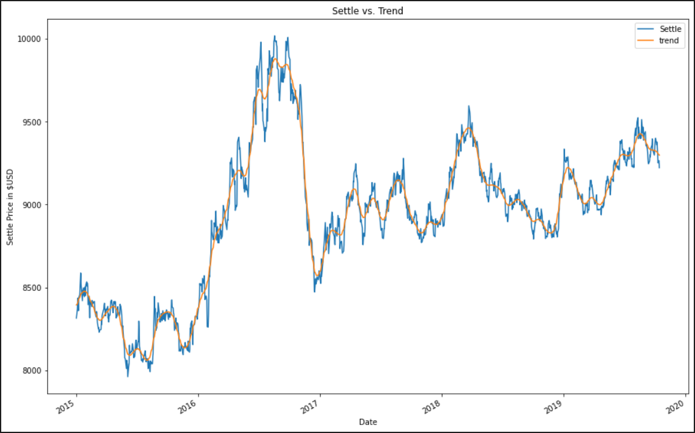

# Yen Futures: Should we buy JPY?

Premise:

* We need to decide if it is financially sound to buy Japanese Yen (JPY) now based on predicted future returns and volatilty.
* We need to forecast the next **5 days** of Yen volatilty and returns, predict if returns are increasing/decreasing that favors buying.
* We will use historic-time series data on Yen returns, and build a series of different models based on different methods *ARMA*, *ARIMA*, *GARCH* using **statsmodels** module.
* We will also use **sklearn** module to make Linear Regression models, splitting the yen data into training and test components, and Rolling Out-of-Sample methods to test the models goodness of fit with the model.

Installs needed

Most of time-series model functions are built-in. To import these modules:

`from statsmodels.tsa.arima_model import ARMA` and `import ARIMA`

For the GARCH model:
`conda install -c bashtage arch` or you simply use `pip install arch`

`from arch import arch_model`

What does the yen data file contain?

Run a simple `.shape` or  on the raw dataframe and it will show 10,902 rows, 8 columns.

* Date, which is the index column because we need to be able to depreciate parts of the date. 
* Open, opening price for the Yen that day.
* High, the highest price for the yen in that day.
* Low, the lowest price for the Yen in the day.
* Last
* Settle, this the main column that we are making our forecasts with. 
* Volume, the amount of yen traded that day.
* Previous Day Open Interest

# Part 1: Time-Series Analysis

## Imports:
<pre><code>import numpy as np
import pandas as pd
from pathlib import Path
%matplotlib inline
import warnings
warnings.filterwarnings('ignore')
</code></pre>

You'll need to import the `sickit-learn` modules. This will be used to

<pre><code>import statsmodels.api as sm</code></pre>

## Read-in data and cleanup

1. Create a starting dataframe by reading in the `yen.csv` and I'll call it `yen_futures`.

<pre><code>
yen_futures = pd.read_csv(
    Path("yen.csv"), index_col="Date", infer_datetime_format=True, parse_dates=True
)
yen_futures.head()
</code></pre>

What you should see

    

 

If you run this code it will show the raw data is 10,902 rows of daily Yen data, in 8 columns. 
<pre><code>yen_futures.shape</code></pre>

2. Slice the dataframe. Only use rows from **Jan 1 1990 to present**. Running the previous `yen_futures.shape` should show 7,515 rows, 8 columns.
<pre><code>yen_futures = yen_futures.loc["1990-01-01":, :]</code></pre>

Sliced dataframe

    

3. Plot the raw returns based on the *Settle* column of the dataset.
<pre><code>yen_futures['Settle'].plot(title='Yen Futures Settle Prices', ylabel='Settle Price in $USD', figsize=(15,10))</code></pre>

What you should see

    

    
Overall the view of Yen settle prices are somewhat increasing as time goes on across the x-axis with periodic bursts of rises/falls. Specifically I am seeing a pattern of gradual incrases followed by gradual decreases, in approximately 4-year intervals. From 1992-1996 there's increase from 6000-12,700, and the from 1996-2000 it gradually declines below 7000 by 1998-1999. There's intermittent bursts of micro-increases and decreases in the trends, likely seasonality is playing a role in that. Year-over-year along the x-axis, we see from approx years 2003-2013 there's a trending increase the spikes in data getting more pronounced. Lots of spikiness plotted raw data presented.

## Decomposing the data into trend/noise components using Hodrick-Prescott filter.

The Hodrick-Prescott filter is a function we use to decompose a time-series dataset into trending and noise components. This is why we imported the `statsmodels` module. 

1. Declare trend/noise variables. We only to decompose based on the *Settle* column-only of the original data.

<pre><code>settle_noise, settle_trend = sm.tsa.filters.hpfilter(yen_futures['Settle'])</code></pre>

2. Create a new dataframe. Add-in columns for the *noise* and *trend* values.
<pre><code>decomposed_yen_settle_prices = pd.DataFrame(yen_futures['Settle'])
decomposed_yen_settle_prices['noise'] = settle_noise
decomposed_yen_settle_prices['trend'] = settle_trend
decomposed_yen_settle_prices.head()</code></pre>

Trend/Noise

    

    

3. Plot the trend vs noise overlay.
<pre><code>decomposed_yen_settle_prices[['Settle', 'trend']]['2015-01-01':].plot(title='Settle vs. Trend', ylabel='Settle Price in $USD', figsize=(15,10))</code></pre>

What you should see

    
So we removed the noise or spikiness/seasonality of the Settle price data, and  can see an overlay of a smooth trend in *orange*. 

## Forecast Model 1: ARMA Model

ARMA models forecast future values based on past values. We build an ARMA model to make our first forecast based on the decomposed *Settle* column. 

1. Transpose the current *Settle* column values to **stationary format**. We can use the **.pct_change()** function to do this. This will calculate the **percent difference** of the current row value from the previous row, and then we'll multiple by 100 to make it clean whole number form. Then we need to drop nulls afterwards.  

<pre><code> settle_returns = (yen_futures[["Settle"]].pct_change() * 100)
settle_returns = settle_returns.replace(-np.inf, np.nan).dropna()                       
settle_returns.tail()
</code></pre>

2. Build the ARMA model. Fit the model to the stationary data to a results variable. We will define the ARMA order, the auto-regressive component as 2, and moving average as 1. This is a second-order ARMA model. Run a summary on those results.

<pre><code>model_1 = sm.tsa.ARMA(settle_returns.values, order=(2,1))
results_1 = model_1.fit()
results_1.summary()
</code></pre>

ARMA summary results

3. Put the forecast results into a dataframe, passing the model results. Plot the forecast for the next 5 days of Yen values based on the past Yen data.

<pre><code> forecast_1 = pd.DataFrame(
    results_1.forecast(steps=5)[0]
)
forecast_1.plot(title='Model 1 - ARMA: Predicted Yen Settle Price Returns 5-Day Forecast', ylabel='Settle Price in $USD', figsize=(15,10))
</code></pre>

ARMA Model Forecast

    

4. **OBSERVATION: Is the ARMA model fitted enough to make good forecasts?** 

ARMA model performance.

No. The ARMA model is forecasting that the value of the Japanese Yen will strongly decline approx 75% (.012 to .003) within the next day, but then gradually increase 125% (.003 to .00675) and remain within the same price range above .0065 for the next 5 days. But I cannt be confident this is ARMA model is fitted to make accurate predictions on the past Yen values.  
    
Based on the ARMA results summary:
* There's 7,514 daily observations being used to make a future prediction. We decomposed the Settle column values. Our original dataset was 10,902 rows of daily data. We are using 75% of the data in the model.
* We increased the lag-terms to 2, so this a second-order ARMA Model
* The p-values for both auto-regressive lag-terms are high. They are not close to zero, or below .01. They're closer to 1. This is the opposite of what we want to see.
* In the first lag-term (ar.L1.y) the error range is between -2.810 to 2.198, which outside the .025-.975 range.
* Both Akakie Information Criterion (AIC) value 15,798 and Bayesian Information Criterion (BIC) value 15,810 are close in range to each other, but they should be very negative numbers. 
* After changing lag-terms adding in a third auto-regressive term, that didn't lower p-values. 

## Forecast Model 2: ARIMA Model

We will use the original *Settle* column values from our original data. That is, we're using the read-in data that isn't decomposed or manipulated. 

1. Import ARIMA model functions.

<pre><code>from statsmodels.tsa.arima_model import ARIMA</code></pre>

2. Build the ARIMA model. Set our model components, p = 5, d = 1, and q = 1. Then fit the ARIMA model to a results variable and run a summary on those results.

<pre><code>model_2 = ARIMA(yen_futures['Settle'], order=(5, 1, 1))
results_2 = model_2.fit()
results_2.summary()
</code></pre>

ARIMA summary results

    

3. Make a forecast of the future Yen Settle values for the next 5 days from the ARIMA results that uses past values. Put these forecasts in a dataframe.
<pre><code>forecast_2 = pd.DataFrame(
    results_2.forecast(steps=5)[0]
)
forecast_2.plot(title='Model 2 - ARIMA: Predicted Yen Settle Price Returns 5-Day Forecast', ylabel='Settle Price in $USD', figsize=(15,10))
</code></pre>

ARIMA Model Forecast

    

4. **OBSERVATION: Is the ARIMA model fitted enough to make good forecasts?**

ARIMA model performance.

No. The performance was marginally better with the increased AR lag-terms. The ARIMA model is predicting Yen values will strongly increase day-over-day for the next 5 days, going from 9224 to 9228. This is using the raw Settle column values of daily Yen prices. However, like the ARMA model the p-values are high for the lag-terms inputted into the model. And we are using five auto-rgressive lag-terms in the model. More lag-terms should lower the p-values. But the p-values are still range above 0.6, and not capped at .01. This confirms my belief we need more daily price data to be confident in the forecast. 
    
Based on the ARIMA summary results:
* We still use 7,514 daily rows.   
* We have five auto-regressive (AR) lag-terms.
* The p-values for each lag-term are marginally better than the ARMA p-values (0.8-0.9), but they are above 0.6, and we need them to be .01 and lower, closer to zero. 
* Some AR lag-terms fall outside the error ranges.
* Both the AIC and BIC values are postive when they need to be strongly negative. 
  

## Forecast Model 3: GARCH Model 

Rising values are not the only thing to consider when making forecasts. We need to know what the risk or volatility there is with this potential investment of buying Yen. If the Yen value is getting and higher and higher over time, and volatility also keeps growing over time in correlation, then that's not a good sign of investing in it. We want value growth to increase and volatility to remain low or decrease. 

We will make a third forecast this time on past price **volatility** as opposed to past values that we did with ARMA & ARIMA models. We will be using the decomposed *Settle* column data to forecast on volatility. We need to use GARCH model functions.

1. Import GARCH model. If we didn't already. 
<pre><code>from arch import arch_model</code></pre>

2. Build the GARCH model. Make sure to set the mean component to "Zero" and not 0. 'Vol' means volatility. Both auto-regressive (AR) or 'p', and moving average (MA) or 'q' is both set to 1. Fit the model to a results variable. Run a summary on the results.  
<pre><code>model_3 = arch_model(settle_returns['Settle'], mean="Zero", vol="GARCH", p=1, q=1)
results_3 = model_3.fit(disp='off')
results_3.summary()
</code></pre>

GARCH summary results

    

3. Forecast the next 5 days/horizons of Yen settle price volatility. GARCH model requires the starting point be the last day of the dataset. First, let's find the last day of the dataset and make sure it's formattted to Y-m-d. For the forecast() function we need to pass in a *start* date (using the the last day of the yen data), and a *horizon* value. 

<pre><code>last_day = settle_returns.index.max().strftime('%Y-%m-%d')
forecast_horizon = 5
forecast_3 = results_3.forecast(start=last_day, horizon=forecast_horizon)
</code></pre>

4. Annualize the variance of volatiltiy forecast horizons. This will pivot each volatility horizon into 'h.1', 'h.2', 'h.3', 'h.4', and 'h.5'. Over the next 5 days we'll see Yen value volatiilty climb from **7.43** to **7.59**. The variance should take into account that there's 252 trading days per year.
<pre><code>intermediate = np.sqrt(forecast_3.variance.dropna() * 252)</code></pre>
<pre><code>forecast_3_final = intermediate.dropna().T
forecast_3_final.head()
</code></pre>

Volatility horizons

5. Plot the GARCH volatility forecast.
<pre><code>forecast_3_final.plot(title='Model 3 - GARCH: Predicted Yen Settle Price Volatility 5-Day Forecast', ylabel='Settle Price in $USD', figsize=(15,10))</code></pre>

GARCH Volatility Forecast

    
    

## Final Conlusion - Should we buy the Yen based on the three models?

Looking at the predictions of these models, the settle price values of the Japanese Yen (JPY) is expected to increase day-over-day for the next 5 days. However, volatility in the Yen market is also expected to increase day-over-day in the same horizon. That makes the risk of this trade into the JPY market increased. When I look at both results of the ARMA and ARIMA models that utilized past settle prices, the one thing that cannot be overlooked is the p-values. Ideally we want p-values for the lag-terms to be closer to zero, to give confidence that each prediction point is close to the predicted trend according to the Hodrick-Prescott filter. But they were closer to 1. I re-tested the models by adding more lag-terms to each (ARMA and ARIMA) models, and that only decreased the p-values somewhat. The p-values were still well above the .01 threshold. The only other way to lower the score is to feed in more daily Yen pricing data.

Personally I cannot be confident that these models can accurately predict the value of the Yen with the pricing data provided for this investing case scenario. Especially with the increasing risk. The p-values were high for each result summary, meaning predictions are not within the predicted trend. Also I feel there isn't enough data, we had a file of over **10,902** rows of daily settle prices, and we fed in **7,514** of those rows, or 75% of the data (after data cleaning). We definitelty need more data to make better predictions if the volatility is expected to increase in this investment.

Conclusion: don't buy Japanese Yen. 
