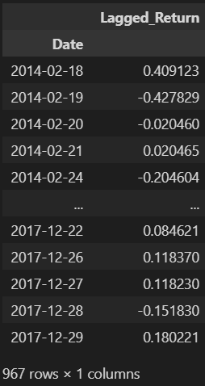
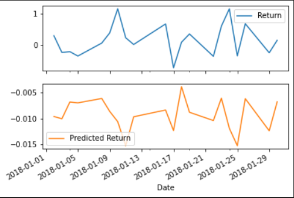
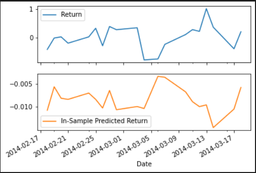

# Part 2: Linear Regression Analysis

We are going to see if a Linear Regression analysis will fair better than the ARMA, ARIMA models. 

# Imports

<pre><code>import numpy as np
import pandas as pd
from pathlib import Path
%matplotlib inline

import warnings
warnings.filterwarnings('ignore')
</code></pre>

# Read-in data and cleanup

1. Read in the Yen daily data. This is the same as Part 1.

<pre><code>
yen_futures = pd.read_csv(
    Path("yen.csv"), index_col="Date", infer_datetime_format=True, parse_dates=True
)
</code></pre>

2. Slice the data for only rows in the year 1990.
<pre><code>yen_futures = yen_futures.loc["1990-01-01":, :]</code></pre>

3. Decompose the *Settle* column to be in stationary format.

<pre><code>
settle_returns = yen_futures['Settle'].pct_change() * 100
settle_returns.dropna(inplace=True)
settle_returns.plot()
</code></pre>

4. Add a column called *Lagged Returns* 
<pre><code>
yen_futures['Return'] = settle_returns.copy()
yen_futures['Lagged_Return'] = settle_returns.shift()
yen_futures.dropna(inplace=True)
yen_futures.head()
</code></pre>

After running `yen_futures.shape` there should now be 1,415 rows and 10 columns. This is much lower than the 7.515 rows from Part 1. 

# Separate data into training (in-sample) independent features, and y (out-of-sample) dependent components

We are predicting Yen values from years 2018 and onward (dependent y values) based on past Yen values 2017 are previous (independent X features). 

1. Create a train/test split. The training in-sample data is rows from 2017 and previous. The testing holdout data is rows 2018 and above. 
<pre><code>train = yen_futures[:'2017']
test = yen_futures['2018':]
</code></pre>

2. Create four unique dataframes, 2 for training, 2 for testing. We will put the X components into a dataframe using `to_frame()`
<pre><code>X_train = train['Lagged_Return'].to_frame()             # Lagged Return is the independent component. 
y_train = train['Return']                               # Return is the dependent component, it's what we're trying to predict. 
X_test = test['Lagged_Return'].to_frame() 
y_test =test['Return']
</code></pre>

3. Analyze the `X_train` data. This is 967 rows of the 1,415 rows.

X_train

    

# Build the Linear Regression Model

1. Import the `sklearn` module
<pre><code>from sklearn.linear_model import LinearRegression</code></pre>

2. Build the model and fit with only the **training** data `X_train` and `y_train`
<pre><code>model = LinearRegression()
model.fit(X_train, y_train)
</code></pre>

# Make Predictions on the holdout testing data

1. Run a prediction on the `X_test` holdout data.
<pre><code>predictions = model.predict(X_test)</code></pre>

2. Assemble the y (out-of-sample) predictions vs actual returns into a dataframe. Add a column for *Predicted Return*,
<pre><code>out_of_sample_results = y_test.to_frame()
out_of_sample_results['Predicted Return'] = predictions
</code></pre>

3. Plot the first 20 predictions of future Yen values.
<pre><code>out_of_sample_results[:20].plot(subplots=True)</code></pre>

Predicted vs Acutal Results (Holdout Data)

    

    

# Model scoring - Holdout (Out-of-Sample/Testing) Data

1. Import the model scoring librariies
<pre><code>from sklearn.metrics import mean_squared_error</code></pre>

2. Find the mean-squared error. Pass in the actual *Return* and *Predicted Return* columns of the holdout dataframe. 
<pre><code>
mse = mean_squared_error(
    out_of_sample_results['Return'],                    # actual returns
    out_of_sample_results['Predicted Return']           # predicted returns
)
</code></pre>

3. Find the root mean-squared error. This is not a good RMSE score. RMSE should be closer to 1.
<pre><code>out_of_sample_rmse = np.sqrt(mse)
print(f'Out-of-Sample Root Mean Squared Error (RMSE): {out_of_sample_rmse}')</code></pre>

# Model scoring - Exposed (In-Sample/Training) Data

Test our predictions on the in-sample data the model is exposed to and then score it.

## Re-Assemble the Model and predict on the training data
1. Re-predict on the model using the `X_train` and not the `X_test`
<pre><code>in_sample_predictions = model.predict(X_train)</code></pre>

2. Assemble in-sample predictions vs actual return into a dataframe. Add-in a column for the in-sample predictions.
<pre><code>in_sample_results = y_train.to_frame()
in_sample_results['In-Sample Predicted Return'] = in_sample_predictions
</code></pre>

3. Plot the actual vs return based on the data the model is exposed to.
<pre><code>in_sample_results[:20].plot(subplots=True)</code></pre>

Predicted vs Actual Results

    

## Score the model based on in-sample predictions

4. Find the mean-squared error and root mean-squared error.
<pre><code>
in_sample_mse = mean_squared_error(
    in_sample_results['Return'],                               # actual returns
    in_sample_results['In-Sample Predicted Return']            # preducted returns
)

in_sample_rmse = np.sqrt(in_sample_mse)
print(f'In-sample Root Mean Squared Error (RMSE): {in_sample_rmse}')
</code></pre> 

# Conclusion: Did using a Linear Regression model impact our confidence on predicting Yen futures?

