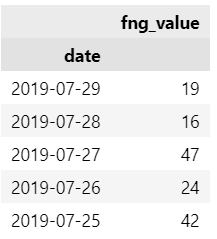
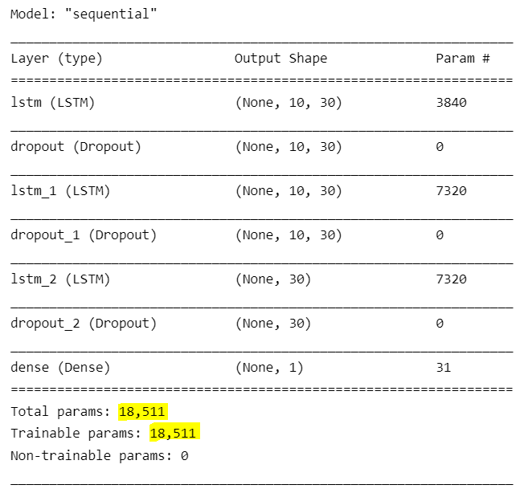

# Bitcoin Fear & Greed Index, LSTM RNN Price Predictor

This program is building an LSTM recurrent neural network (RNN) to predict future Bitcoin prices based on a rolling-past crypto **sentiment** scores. We're using time-series BTC price data and the Fear & Greed (FNG) Index of crypto sentiment scores from crypto news sources to see if past sentiments can predict the next BTC closing prices.

## The Data

We are provided with files of BTC closing prices, as well as FNG sentiment scoring for Bitcoin on that unique trading day. We didn't need to fetch the API data for this particular excercise, and there's no need to do sentiment analysis since it was done by the FNG, so it can be read-in. But the setup for our RNN model is predicting on a rolling-window of past sentiments. 

A few things to note:

* The FNG sentiment scores come from various crypto news sources the Index web scrapes for that trading day in BTC.
* **Extreme bias.** We're using online posts and articles of people who have varied opinions about crypto as the sole predictive feature. There's no way this predictor we're building will be un-biased. We are trying to predict what the monetary value of a very speculative asset will be on a few people's words. 
* The closing price is whatever the BTC value was for that day. Except there is no real closing time period in crypto. Crypto is traded world-wide 24/7, so we will assume this is going up to 11:59PM each day. 
* Splitting the data 70/30. 70% of the BTC price data will be exposed to the model.
* Rolling windw of 10-days of sentiment scores. What was said about BTC in the past 10 days to see what the price will be. 
* The RNN model will be a deep, 3-layered model with LSTM layers feeding input data into the next layer.

## Imports
```
import numpy as np
import pandas as pd
import hvplot.pandas

from sklearn.preprocessing import MinMaxScaler
from tensorflow.keras.models import Sequential
from tensorflow.keras.layers import LSTM, Dense, Dropout

from numpy.random import seed
seed(1)
from tensorflow import random
random.set_seed(2)
```

## DataFrame Setup

We have two csv files. One for past BTC prices, and the other is Fear & Greed (FNG) sentiment scores. We'll read these files in and concatenate them. It'll be a very simple Dataframe with two columns. The FNG sentiment is what's predicting future closing price of Bitcoin.

Read-in ***btc sentiemnt*** 
```
df = pd.read_csv('btc_sentiment.csv', index_col="date", infer_datetime_format=True, parse_dates=True)
df = df.drop(columns="fng_classification")
```
Read-in the historic prices.
```
df2 = pd.read_csv('btc_historic.csv', index_col="Date", infer_datetime_format=True, parse_dates=True)['Close']
df2 = df2.sort_index()
```

Concatenate both files with a simple inner join
```
df = df.join(df2, how="inner")
```


## Data Pre-Processing

### Part 1: Define X & y components

This is time-series data that will be using a rolling-window of values to make a prediction. Even though it's a simple file. The X-features are the FNG sentiment scores, and the y-target vector is the closing price. However, we can't simply set `X = df['fn
This will be kind of a complicated way of separating the X & y components. We are not just setting the target to a column, and the X features to everything else. The dataframe itself is very basic. This time we're building a custom **function** that will use a for-loop to iterate through the BTC data, and append the *column numbers* of X and y components to their own lists.  

We will define a function using the `window_data()` function. Pass in the following 4 arguments: *the raw DataFrame of BTC prices and sentiment scores*, *window of 10 days*, *the column number of the FNG sentiment score*, and *the column of the Bitcoin closing price*.

We weill append the X predictive features to the empty list **X** and closing price y-targets to the list called **y**

```
def window_data(df, window, feature_col_number, target_col_number):
    X = []
    y = []
    for i in range(len(df) - window - 1):
        features = df.iloc[i:(i + window), feature_col_number]
        target = df.iloc[(i + window), target_col_number]
        X.append(features)
        y.append(target)
    return np.array(X), np.array(y).reshape(-1, 1)
```

Define the 4 needed arguments. `window_size` is 10 for 10-day rolling window of prices. X column is the 0th column and the target closing price is the 1 column. Call on this window_data function. 
```
window_size = 10
feature_column = 0
target_column = 1
X, y = window_data(df, window_size, feature_column, target_column)
```

### Part 2: Splitting the data up into training and holdout sets

We are exposing **70%** of the data to the RNN model. We will manually split the data as opposed to importing the `train_test_split()` function from keras. This is because this is time-series data, and we need to focus on the sequences. Whereas, with classification problems it was much simpler. 

```
split = int(0.7 * len(X))              # taking 70% of the entire length of X features. 

X_train = X[ : split - 1]
X_test = X[split : ] 
y_train = y[ : split - 1]
y_test = y[split : ]
```

### Part 3: Scale the data

Use the `MinMaxScaler()` to scale the data between values of 0-1. Create four scaler objects for each dataset. 

```
X_train_scaler = MinMaxScaler()          # create a Scaler object
X_test_scaler = MinMaxScaler()
y_train_scaler = MinMaxScaler()
y_test_scaler = MinMaxScaler()
```

Fit the X & y splits to these scalers.
```
X_train_scaler.fit(X_train)             # fit the X features to the scaler
X_test_scaler.fit(X_test)
y_train_scaler.fit(y_train)
y_test_scaler.fit(y_test)
```

Transform the BTC values to be 0-1 for all four datasets.
```
X_train = X_train_scaler.transform(X_train)
X_test = X_test_scaler.transform(X_test)
y_train = y_train_scaler.transform(y_train)
y_test = y_test_scaler.transform(y_test)
```
Reshape the data to be 1 column.

```
X_train = X_train.reshape((X_train.shape[0], X_train.shape[1], 1))
X_test = X_test.reshape((X_test.shape[0], X_test.shape[1], 1))
```

## Building the model

Create a Sequentual NN model object. We'll then add layers to it. Also, we will be utilizing *Dropout* layers at each step to control for overfitting. After each LSTM layer we will drop a random 20% of the data, and keep the remaining 80%. And it will repeat after every LSTM layer. Set `dropout_fraction` to **0.2**. And each LSTM layer will have 30 neurons. 
```
model = Sequential()
dropout_fraction = 0.2     # drop random 20% of data after each LSTM layer.
```
Add first LSTM layer. Along with a Dropout Layer. Make sure to include `return_sequences = True` to connect the next LSTM layer. Pass the `dropout_fraction` in the Dropout Layer. 
```
model.add(LSTM(
    units =30,
    return_sequences = True,                        # include this to connect another LSTM layer
    input_shape = (X_train.shape[1], 1)
))

model.add(Dropout(dropout_fraction))                # Dropout layer, drops random 20% of the data.
```
Add the second LSTM layer. Along with a Dropout layer to drop another random 20% of data.
```
model.add(LSTM(
    units = 30,
    return_sequences = True                         
))

model.add(Dropout(dropout_fraction))               # Drop another 20% of random data.
```

Third LSTM layer and Dropout. No need to include a `return_sequences = True`.
```
model.add(LSTM(units = 30))
model.add(Dropout(dropout_fraction))
```

Output Layer. A Dense layer returning 1 output. We don't put a Dropout on the output layer.
```
model.add(Dense(1))
```

Compile it all together. We use **mean_squared_error** for the loss function because this is time-series data. We will use the **adam** optimizer on that loss function.
```
model.compile(optimizer = 'adam', loss = 'mean_squared_error')
```

Summary of RNN layers.
```
model.summary()
```


## Running the Model

Fit the NN 

```
model.fit(
    X_train,
    y_train,
    epochs = 10,
    shuffle = False,                # putting Shuffle = False allows model layers to shuffle the input data to best weight the features. 
    batch_size = 1,
    verbose = 1
    )
```

# Conclusion

Terrible model. The optimizer couldn't effectively make the loss values reduce at each epoch. I would never use sentiment scores to predict crypto values. This is worse than using direct prices that are never static. The source data is too simple in nature. We just have sentiment and closing prices. A good price predictor should be based on *percent change* in values within a rolling-window, as opposed to direct past price points, or even this. People are biased in their perception of cryptocurrencies and what they write 

