# Part 1: Zbank Ethereum Poof-of-Authority Puppernet Token/Testnet

## Please Read First!

I am student, not a professional programmer, doing an exercise intended for students self-learning blockchain. 

**WARNING:** This assignment involves open-source Ethereum software and online digitial wallet applications. If you plan on doing this project, please make sure you have up-to-date anti-virus software installed on your computer. We are using the **Geth-Network** command-line software, or **"Geth"**, to complete these tasks, and running this software will expose your local computer to the internet. The exposure risk only happens at the final steps when we officially turn on and execute our ethereum testnet to mine our tokens. The latest versions of Geth are much safer from hackers, but still have anti-virus enabled and don't click 'ALLOW' or any permission window that pops up. The real risk is if you share information about your test netowrk or private keys to others online while the network is running.  

A few final things to note about what we're doing:
* This is a custom test-blockchain-network we are building on our local machine. 
* Nothing we do in this project will be on the Ethereum mainnet, or any of the test networks such as: Ropsten, Kovan, or Rinkeby.
* The crypto tokens produced by our testnet will have no monetary value. There's no real Ethereum involved.
* This will be a **proof-of-authority** network. The only nodes running this network should be your own computer.
* Do not share any private keys or network RPC addresses to others online unless you trust them to help you with your testnet.
* Terminating your git bash sessions will immediately stop the network and close your connection online. 

## Premise

We are a blockchain developer working for a fictional bank called ZBank that's looking to get into blockchain. ZBank wants to issue a crypto token called "puppernet". We want to develop a test blockchain-network and mine these tokens. Then we will send these mined bank tokens to a digitial wallet, in this case using MetaMask, and then from MetaMask create a mock transaction to transfer some tokens to another wallet address. All we need is a snapshot of the transaction when it successfully completes. 

## Tools Used

* Git Bash (required), Geth only works in git.
* Geth, or GO-Ethereum, a command-line tool used to generate and run Ethereum-based blockchain networks.  
* MetaMask, an online digitial crypto wallet. There is the option of MyCrypto, but I personally find it better to use MetaMask.

## Setup-Geth

First download the Geth tool. After downloading, store in a folder on your C: drive. I named mine *geth* because it's memorable to me. You'll see multiple applications. The Geth suite has multiple programs. We are only going to to need the **geth** and **puppeth** applications. 

## Task 1 - geth: Creating Network Node 1.

Blockchains require nodes to run the network. We create nodes in geth application that will generate wallet addresses.

* On Git-bash navigate to your folder with your Geth tools.
* The `./geth` commmand starts geth program. We will use `account new` feature to create a new account node.
* Enter the command `./geth account new --datadir zbank/node1` and then hit Enter. 
* Create a password, or you can hit Enter. *I'd advise making a password*. 
* Repeat the password, or hit Enter. 
* Generate a wallet address. **Copy the wallet address**. 
* The private key (the password) is stored in a secure keystore file. 
* A folder called **zbank** is created. And inside zbank folder is a subfolder called **node1**. This is what the `--datadir` flag passed in the command does.

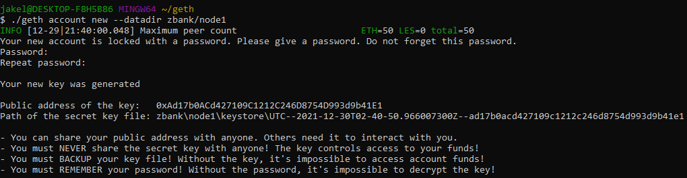

**What we want to see:**

There should be on your local computer a new folder created called **zbank** with subfolder for **node1**. Every node created will be like this. 

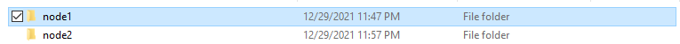

Inside node1 or any node folder there should be both a **geth** and **keystore** folder.

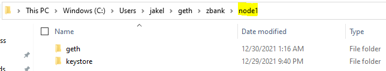

Inside the keystore folder there should be a `UTC` keystore file. This improtant. If it's not there then something went wrong creating the node. Only solution would be to re-create again. 

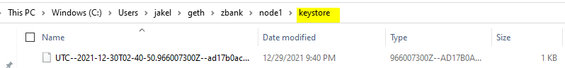

## Task 2 - geth: Creating Network Node 2.

* Repeat the same command, only change the name of the node. 
* `./geth account new --datadir zbank/node2`
* This will generate its own wallet address. **Copy this wallet address**. There will be a new subfolder for **node2** created. 

Every network node will have its own wallet address, its own subfolder, that will store its own keystore file, and its own copy of the genesis block. 

### Optional Task: Storing Node Passwords.

When creating the nodes it's optional to make a password for it. Be default geth automatically generates a wallet address and a private key for the node. The private keys for this wallet are stored in a keystore file, which is stored locally on your computer. Keystores are a safe and efficient. A hacker would need to guess your private key. 

I added passwords to the nodes for extra security. This means when we run the network we'll be prompted to enter a password for our nodes. But we can also pass commands to auto-fill these passwords 

## Task 3 - puppeth: Creating Puppernet Network and Genesis Block.

We use the puppeth application to make an Ethereum test network, and genesis block that is the foundation of any blockchain.

* On Git-bash navigate to your folder with your Geth tools.
* Enter `./puppeth` command to run puppeth applicaiton.
* Enter `puppernet` as the network name in lowercase. Hit Enter. *You can't use capital letters, spaces, or symbols in puppeth*.
* **What would like to do?** Hit option 2, `Configure new genesis`.
* `Create new genesis from scratch`.
* **Which consensus to use?** Option 2, `proof-of-authority`.
* **How many seconds should blocks take?** Hit Enter. The default is fine.
* **CRITICAL: Which accounts are allowed to seal?** Enter the wallet addresses from your two network nodes created, and do not include the `0x` at the beginning. Hit Enter.
* **CRITICAL: Which accounts should be pre-funded?** Enter the wallet addresses from your network nodes. Hit Enter.
* **Should the precompile addresses be re-funded with 1 wei?** `no`. *We are not going to do that even if it's advisable*. 
* **Specify a chain/network ID:** `input any number here you can remember`. The *Chain ID* is your network ID number, and is used for signing transactions. Problems mining blocks because of failure to sign is likely because of an incorrect Chain ID when linking a node.  

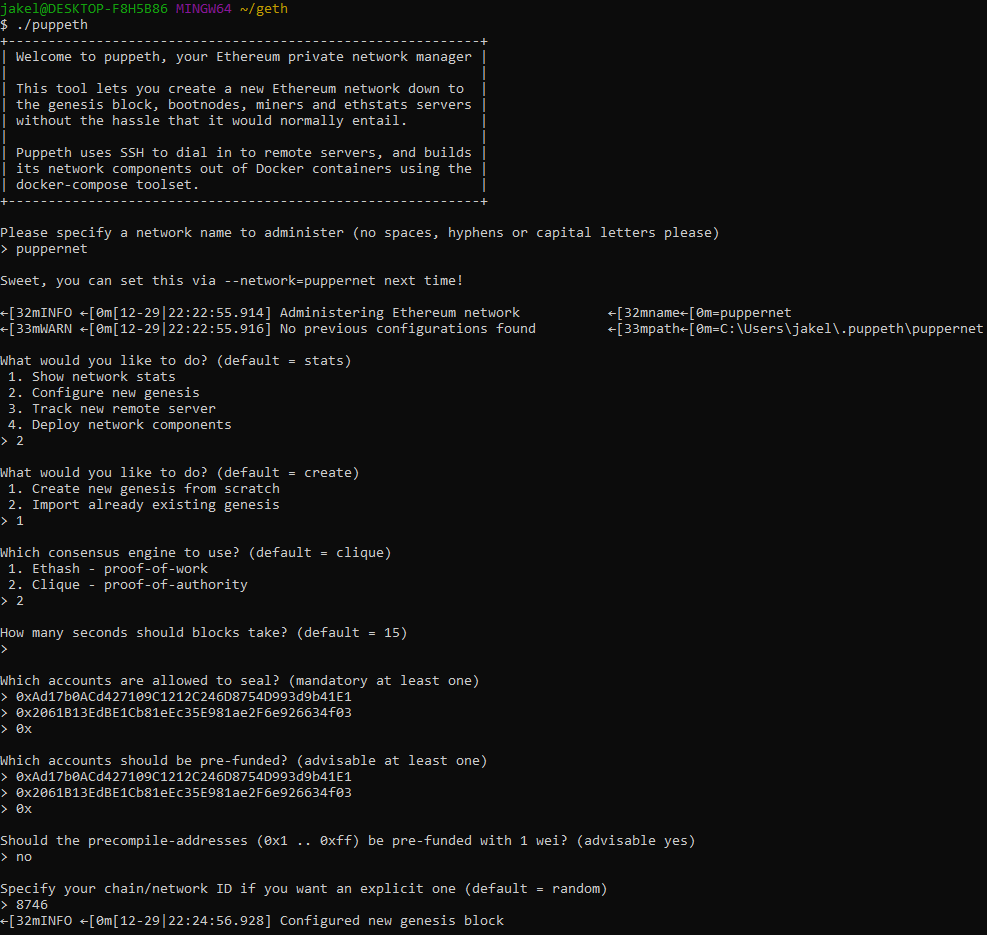

## Task 4 - puppeth: Exporting the genesis block to a JSON file.

We're still in puppeth. After making the new *puppernet* network and genesis, puppeth will ask if you want to do more.

* `Manage existing genesis`.
* `Export genesis configurations`.
* **Which folder to export to?** *zbank, we want to keep everything in the same network folder*. 
* Enter `Ctrl-C`, to exit puppeth application. We want to stay in the directory and activate `geth` application again.  

This is making a copy of the genesis block into several JSON files. We do not need to care about the `aleth.json`, or `harmony.json`, or `parity.json`. We only care about the regular JSON file. All of this will be in a zbank folder. 

**NOTE:** We will no longer need to use puppeth after this. 

## Task 5 - geth: Initialize a copy of genesis block into network nodes.

We will be using geth application the rest of the project. We need to make a copy of the genesis block for every network node. We only made 2 network nodes. 

* Enter command `./geth init zbank/puppernet.json --datadir zbank/node1`
* Repeat this command for the second node replacing with *node2*
* You should see the message `Successfully wrote genesis state` for each command. If you go into each node subfolder, a copy of the genesis file is there. 

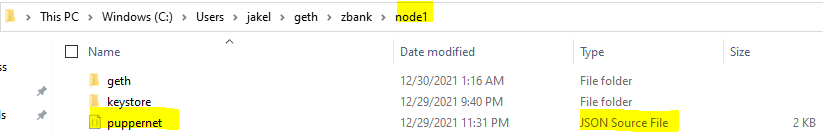

## Task 6 - geth: Start the blockchain, the mining node.

The mining node starts the blockchain. It will mine and seal empty blocks. Node 1 will be our mining node.

**NOTE:** This is the part that is the securtiy risk. Be careful. 
**NOTE:** I am using a Windows PC for this, and geth has additional flags for Windows users. 
**NOTE:** Updated versions of geth have changed the names of flags, so you might get `flag provided but not defined` message many times. 

* Be in Git-bash in our Geth-tools folder.
* You need the wallet address of node1.
* Enter this command and hit Enter.  

`./geth --datadir zbank/node1 --mine --miner.threads 1 --http --password zbank/password1.txt --ipcdisable --unlock 0xAd17b0ACd427109C1212C246D8754D993d9b41E1 --allow-insecure-unlock --http.corsdomain "*"`

**Flags explained:** 

`--mine` indicates the mining action. 
`--miner.threads` specifies the number of CPU workers mining. *I'm on a latop so I assigned 1, because geth slows my laptop down.* 
`--http` replaces the `--rpc` flag. This is exposes our computer port as an endpoint that allows external connections to our testnet. Needed to be able to connect our MetaMask digital wallet. 
`--password` will bypass the `Enter password` prompt and will pass in the password via *.txt* file. *I called my file **password1.txt*** 
`--ipcdisable` flag for Windows-users only, tells geth not use the `ipc` protocol on your computer.  
`--unlock` unlocks the wallet if there's a password. Pass the `0x` wallet address for the node after this flag. 
`--allow-insecure-unlock` permits other nodes to connect to the mining node. 
`--http.corsdomain` allows cross-domain connections from external sources, pass `"*"` to allow *all* online locations (the security risk), so we can connect thru MetaMask.

Geth will start the mining node. You'll see a display of a lot of information. Ideally there shouldn't be any warnings, but most warnings are ignorable. Please see Troubleshooting documentation for explanations.

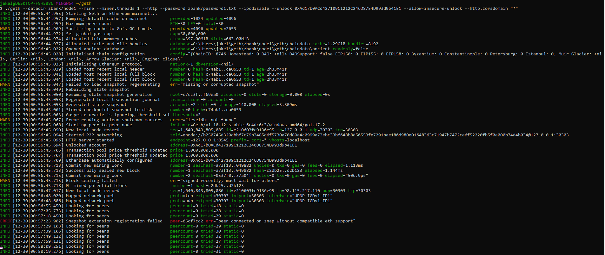

* **CRITICAL:** Copy the `self=enode://` address quickly. *You need to copy the whole thing that including the port number 30303*.
 
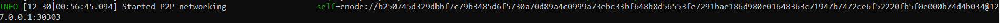

* Final display you should see `looking for peers` displayed. The `peercount=0`. *There's no other nodes on this network until we add them*.

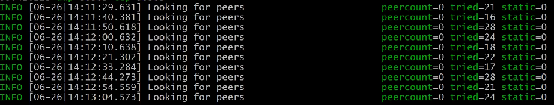

**What we want to see:**

Geth should be busy mining empty blocks in the background until we get a peer node running.

* The display should be `Commit new mining work` followed by `Successfully sealing block`. Then it should commit to new block work again. 

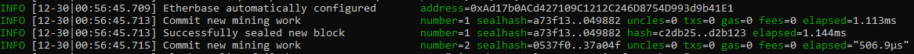

* If there's `Block sealing failed` this is a problem only if the block couldn't be signed and you see `err=unauthorized signer`. Right now there's no other nodes on the network. See Troubleshooting documentation. 

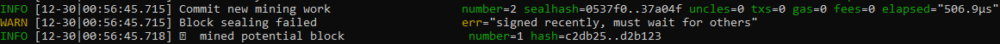

## Task 7 - geth: Start the peer node.

**NOTE** You need to open a separate Git-bash session to run the peer node in conjunction with the git session running your mining node.
**NOTE:** You need to have copied the `self=enode://` address from the mining block. 
**NOTE:** The mining node is running on **port 30303** be default. We need to run our peer node on a different port. Just go up 1 number and use **port 30304**.  

* Open a new git session and navigate to your correct folder with your geth tools and network files. 
* Enter this command and hit Enter.

`./geth --datadir zbank/node2 --port 30304 --bootnodes "enode://b250745d329dbbf7c79b3485d6f5730a70d89a4c0999a73ebc33bf648b8d56553fe7291bae186d980e01648363c71947b7472ce6f52220fb5f0e000b74d4b034@127.0.0.1:30303" --ipcdisable`

* You have to put the enode for the mining block after `--bootnodes` flag in quotes "". 
* Make you drop the `self=` part and put the `enode`.
* Make sure the `--port` flag has a different number. 
* We don't need to unlock the wallet, or pass any passwords for this command, as node2 serves as network support. Any mining rewards and tokens will be in node1 wallet.

**What we should see:**

The same display as when we started the mining node. With a proof-of-authority network both nodes are mining, so both screens should display the same thing.

You'll also see the `peercount=1` because a node is connected. And it should also show mining block work and looking for peers.

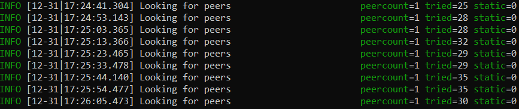

## Closing the network

Just close down the Git-bash session and it will terminate the network. Any node connection is severed. But we need to have the network running for the second part of this project.

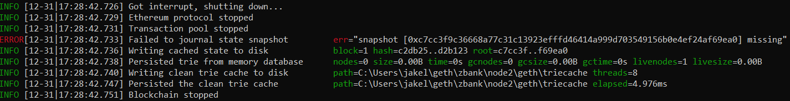
