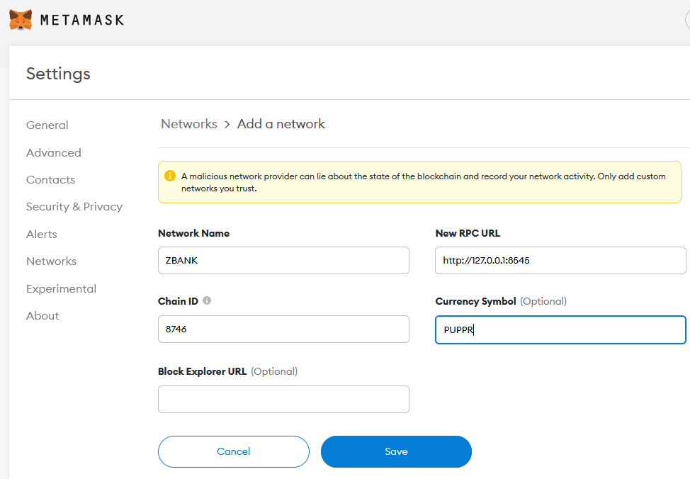
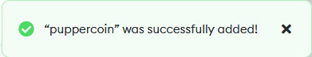
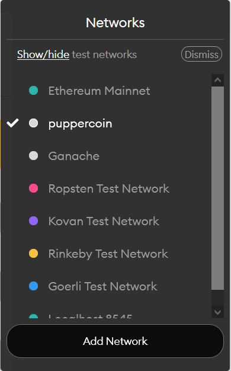
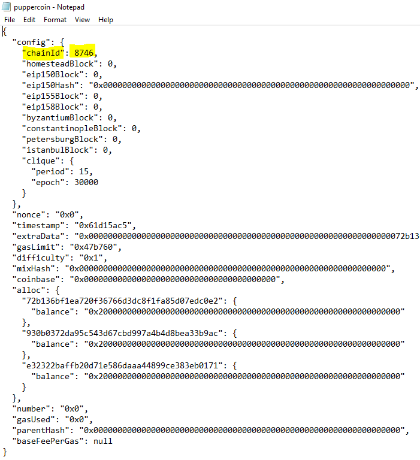

# Part 2: MetaMask Connection to Testnet

Our `puppercoin` blockchain testnet should be running and mining/sealing blocks. We ran our network to allow node connections from external online sources. We'll connect our MetaMask to the network. This part required copying and pasting a MetaMask wallet address into `puppeth` when making the `puppercoin` network. 

## Part 1 

* In MetaMask choose **Custom Network** from the dropdown list of Ethereum networks. 

**What you should see:**

* Put any network name you want. 
* **RPC URL** sould be `127.0.0.1:8545` is the default port that connects to your local computer.
* **CRITICAL:** Enter the `Chain ID` you established when you made the network. 
* Make a symbol for your token if you want.
* Click Save

**What you should see:**

* You'll see a message that it successfully added.

* You can see the testnet on your network drop-down options.

## Chain ID failed.

If the Chain ID fails. Check your genesis block .JSON file, and make sure the Chain ID is matching what you're typing.

